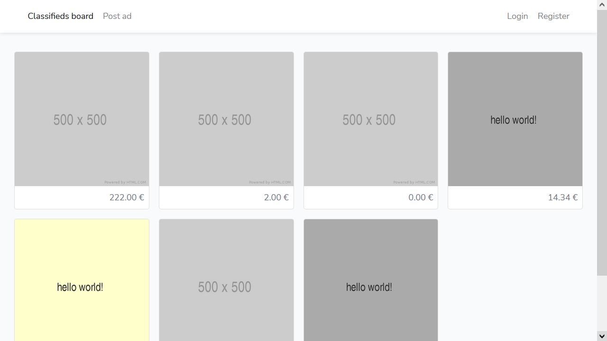
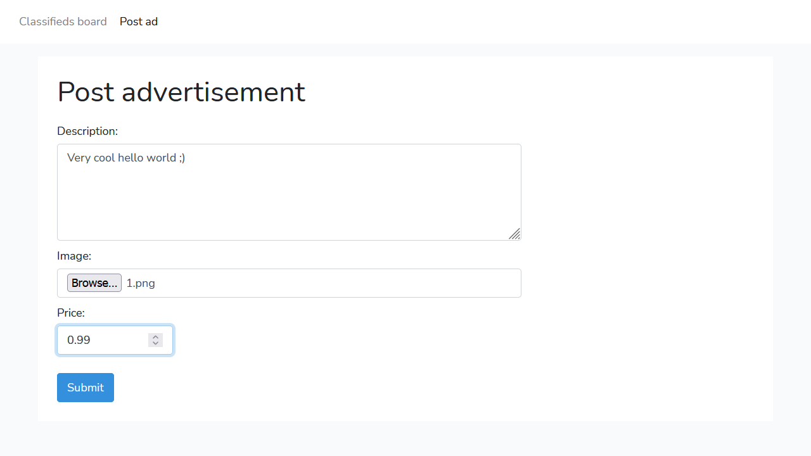
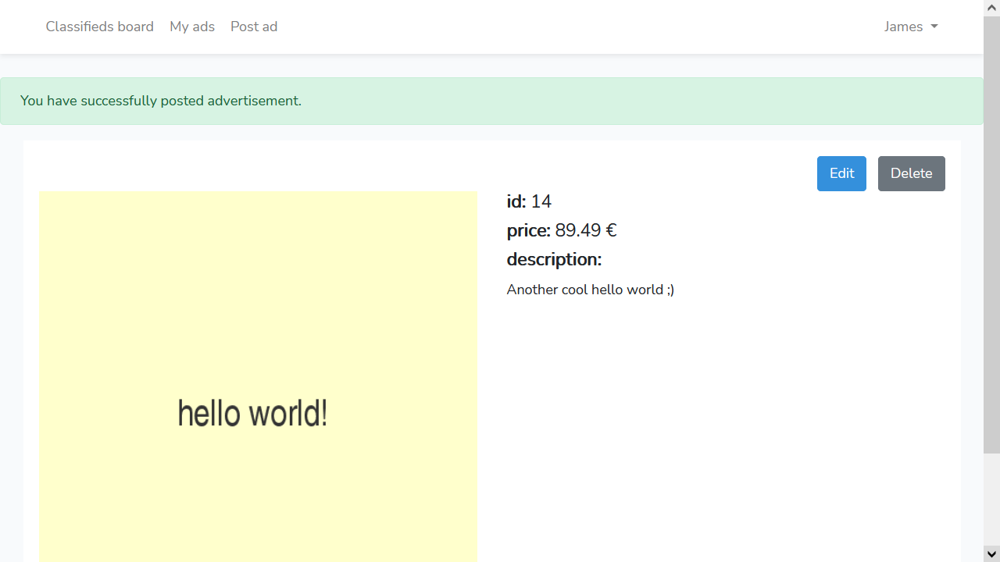

# Classifieds Board in Laravel 8
Simple classifieds board in laravel 8 with bootstrap, CRUD and image file upload.

## Getting Started
### Prerequisites
Things you need to install.
- [PHP](https://www.php.net/downloads.php) (tested on PHP 8.0.7)
- [MYSQL](https://dev.mysql.com/downloads/) (or other database)
- [Node.js](https://nodejs.org/en/download/current/) (get latest)
- [Composer](https://getcomposer.org/download/)

### Installation and Run
1. Clone repository using command `git clone https://github.com/vytautashi/classifieds-board-in-laravel.git`
2. Change working directory using command `cd classifieds-board-in-laravel`
3. Run command `composer install`
4. Run command `npm install & npm run dev`
5. Copy file `.env.example` and name it to `.env`
6. Update db credentials (_DB\_*_) at file `.env` and create database
7. Run command `php artisan key:generate`
8. Run command `php artisan migrate`
9. Run website by running command `php artisan serve`
10. Access your website url (for example: [http://localhost:8000/](http://localhost:8000/))

### Custom commands
Project has custom commands.
#### Command 'delete-old-ads'
Deletes advertisements that are older than specified age in days (default value: 30)

**commands examples:**
```
php artisan delete-old-ads
php artisan delete-old-ads 60
php artisan delete-old-ads 0
```
- first commands deletes advertisements that are older than 30 days.
- second commands deletes advertisements that are older than 60 days
- third commands deletes all advertisements

## Screenshots
**Homepage**


**Post advertisement**


**Advertisement**

